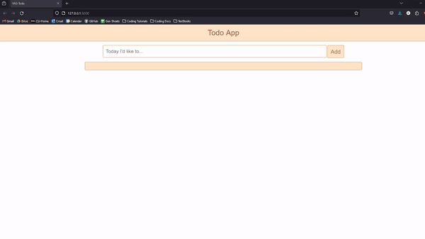

# Yet Another Generic Todo App

  
A simple implementation of a todo app made using the Flask Library and a SQLite database.

## The Challenge

An assignment from the Computer Systems Development Project (SYSC3010) course at Carleton University, wherein students can make a tutorial on a topic not covered in lectures/labs.

I (try to) give a brief introduction to two technologies I've just started learning: Flask and SQLite, by building a todo app.

## Tutorial

Read the markdown tutorial [here!](Todo-memo.md)

## Tools & Technologies

